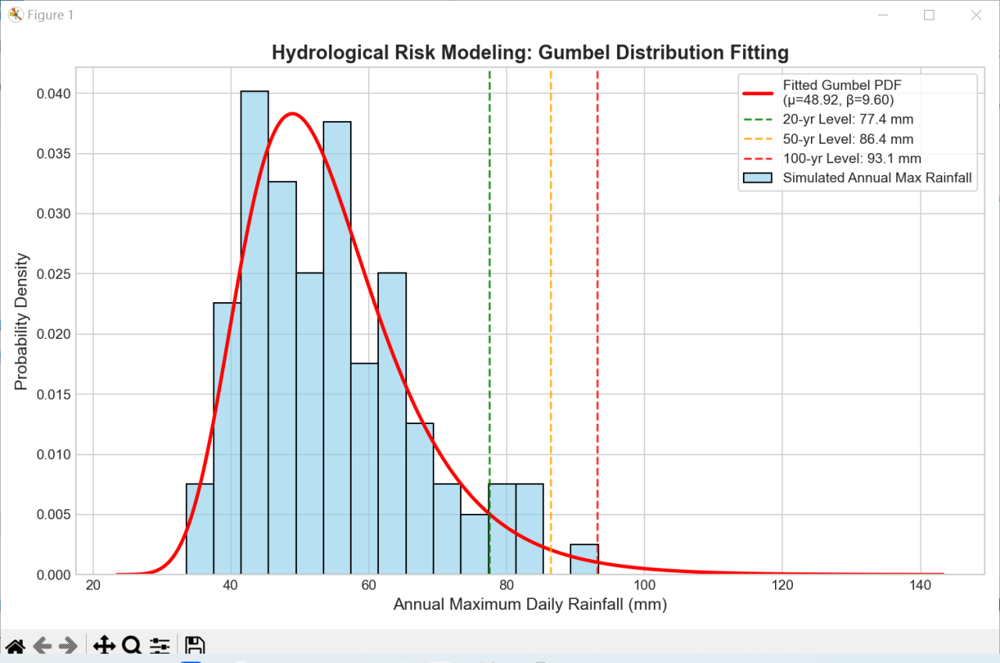

# Probabilistic Modeling: Gumbel Distribution for Extreme Value Analysis

This repository demonstrates the application of **Extreme Value Theory (EVT)** to model hydrological risks, such as annual maximum rainfall—a critical factor for flood forecasting in regions like the Pearl River Delta.

### 1. Mathematical Logic
As a graduate in **Mathematics and Applied Mathematics**, I chose the **Gumbel Distribution** (Generalized Extreme Value Type I) because it specifically focuses on the distribution of the maximum of a sample, providing more accurate risk estimation than a Normal distribution for extreme events.

The Probability Density Function (PDF) is expressed as:
$$f(x; \mu, \beta) = \frac{1}{\beta} \exp\left(-\frac{x-\mu}{\beta} - \exp\left(-\frac{x-\mu}{\beta}\right)\right)$$

### 2. Core Results
Using **Maximum Likelihood Estimation (MLE)**, the model successfully fitted the simulated data with the following parameters:
- **Location ($\mu$):** 48.92
- **Scale ($\beta$):** 9.60
- **100-Year Return Level:** 93.09 mm (Indicates a 1% probability of exceedance in any given year)

### 3. Visual Demonstration

*(Note: I am using the visualization from the code output to demonstrate the fit between the simulated rainfall data and the Gumbel curve.)*

---
**Author:** Wang Siyun (Changkjiu)
**Target:** Prospective MPhil Applicant for Red Bird MPhil, HKUST(GZ)
